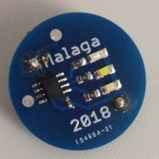

# LED-brooch-with-ATTINY13
Light patterns with 3 LEDs - a party gag

This was a project for me to learn about the ATTINY13A, one of the most low cost processors. They are small form factor
and ideal for a brooch I created. The purpose is that a group of people can 'see' each other in the night in a foreign city,
so nobody gets lost.

There are two contacts at 9 and 12 o'clock, if connected briefly with a small cable you may toggle the light-show on and off.

The battery is 3V CR2016
I use different color LEDs all SMD1206 and resistors to adapt for different forward voltage:
* White/Blue: FV 2.8-2.9V   5.6 Ohm
* Red/Yellow: FV 2.0-2.2V  47.0 Ohm
* Green:      FV 2.7-2.8V  12.0 Ohm
